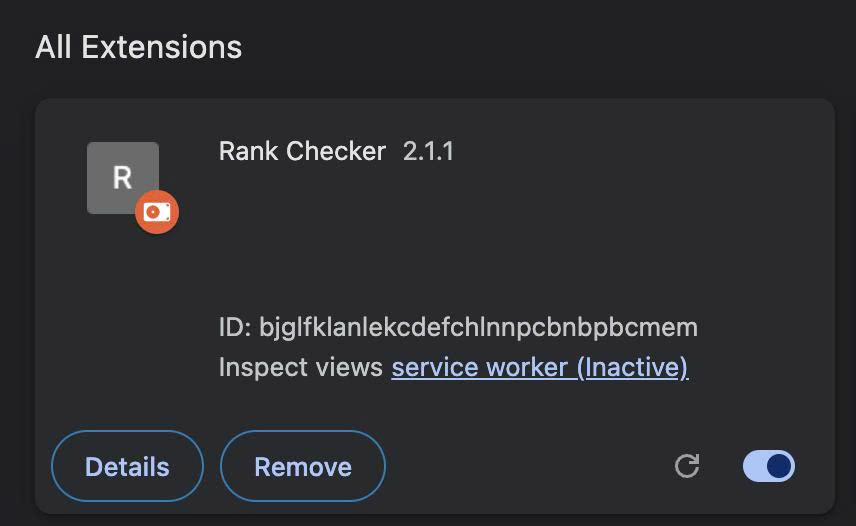

# 🔎 Google Keyword Rank Checker

### Chrome Extension for checking a website's ranking position on Google Search

**Simple • Lightweight • Fast • Open Source**

---

## 📌 About

**Google Keyword Rank Checker** is a lightweight Chrome Extension that helps you quickly check where a specific website appears in Google Search results for a given keyword.

Instead of manually browsing through multiple Google result pages, the extension helps identify the ranking position of your website directly from your browser.

This project is open source and created for:

- SEO learning and research
- Developers interested in Chrome Extension development
- Website owners checking keyword positions
- SEO specialists and digital marketers
- Educational and reference purposes

---

## ✨ Features

🔍 **Keyword Rank Checking**  
Check the Google Search ranking position of a specific keyword.

🌐 **Domain Detection**  
Find the position of a specific website/domain in search results.

⚡ **Fast & Simple**  
Minimal interface designed for quick keyword checking.

🧩 **Chrome Extension**  
Runs directly inside your Chrome browser.

📊 **SEO Friendly**  
Useful for basic SEO research and keyword monitoring.

🔓 **Open Source**  
Source code is publicly available for learning, modification and contribution.

🪶 **Lightweight**  
No unnecessary libraries or complicated setup.

---

## 🖼️ Preview

> Screenshots will be added soon.

You can add screenshots to:

